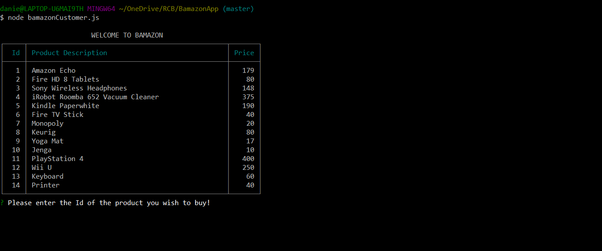

## Summary

An interactive shopping node app where MySQL and Node.JS are used to allow users to purchase items as a customer,and to view, track and update the product inventory as a manager.

### Customer View

When user first runs the application bamazonCustomer.js 

#### End of transaction

