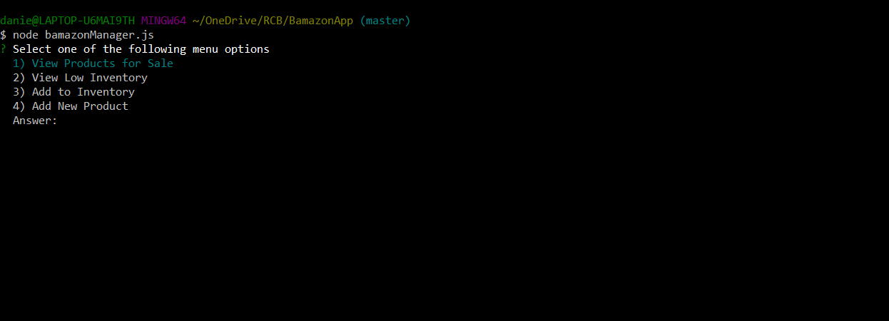
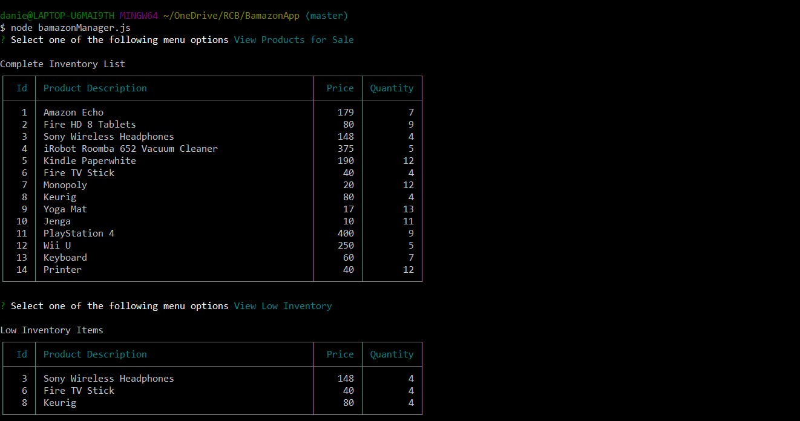
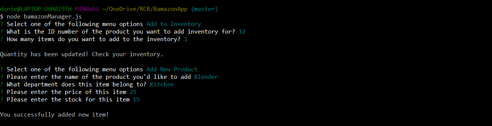

## Summary

An interactive shopping node app where MySQL and Node.JS are used to allow users to purchase items as a customer,and to view, track and update the product inventory as a manager.

### MySQL Database Setup
In order to run the application, you must have the MySQL database set up on your machine. If you don't, visit the [MySQL installation page](https://dev.mysql.com/doc/refman/5.6/en/installing.html) to install the version you need for your operating system. Once you have MySQL installed, create the *Bamazon* database with the SQL code found in [schema.sql](https://github.com/danielladt/BamazonApp/blob/master/schema.sql) and then add *products* to database using [seeds.sql](https://github.com/danielladt/BamazonApp/blob/master/seeds.sql). Run this code inside your MySQL workbench, then you may proceed with running the Bamason customer and manager interfaces. 

### Customer Interface

The Bamazon Customer Portal allows users to view the current items available for purchase. The user will be prompted to enter the item id# and how many items they wish to purchase. If the item is in stock, the order will be completed and the user will see the total amount of their purchase.

To run the customer interface please follow the steps below in your terminal or git bash:

    git clone https://github.com/danielladt/BamazonApp.git
    cd bamazonApp
    npm install
    node bamazonCustomer.js

### Manager Interface

The Bamazon Customer Portal allows users to view and edit the inventory of the store. The user will be prompted to choose from the following options:

    1. View products for sale
    2. View low inventory
    3. Add to inventory
    4. Add a new product

Running the manager interface is similar to customer interface. Please follow the steps below in your terminal or git bash:

    git clone https://github.com/danielladt/BamazonApp.git
    cd bamazonApp
    npm install
    node bamazonManager.js    

#### Options 1 & 2

The first option allows the user to see the list of products that are currently for sale, the price of the product and how much stock is left for that product.

The second option allows the user to see a list of all inventory items that have less than 5 items in stock. If there are no products that meet this criteria, the user will see an empty table.

#### Options 3 & 4

The third option allows the user to update the inventory for a specific product. A prompt asks what the id is for the product the user wants to update. A second prompt asks how many items the user wishes to increase the quantity by.

The last option allows the user to add a new product to the inventory. Prompts ask the user for the product name, the department name, the price and the stock quantity.

